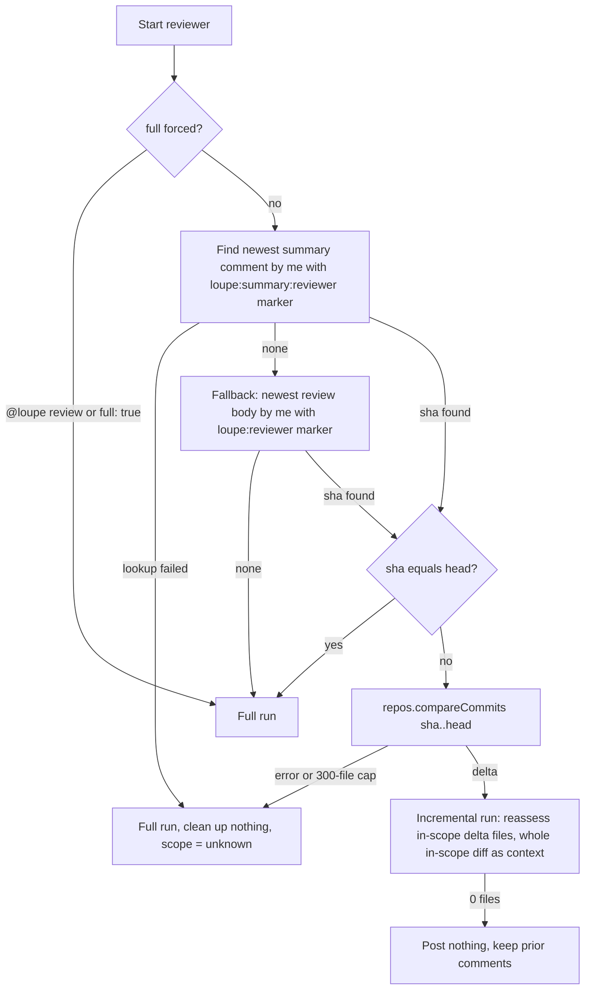

# First run vs later runs

The only state loupe keeps is a SHA inside its own comments. Each reviewer keeps its own.

## Decision

The "sha equals head" case happens on `reopened` or `ready_for_review` with no new commits, and on a manual re-run. Treating it as a full run means the review is recomputed and replaced, not skipped.

## Example: first run, then a push

| | First run at SHA A | Later push at SHA B |
| --- | --- | --- |
| Marker found | No | Yes, SHA A |
| Files assessed | All 12 in scope | 2 changed since A |
| Diff context | All 12 patches | All 12 patches |
| Prior threads touched | None | Only threads on those 2 files |
| Summary marker after run | SHA A | SHA B |

This is the **next push** loop from the [overview](./README.md#30-second-picture): the summary marker sends the next review back through scope selection without discarding findings on untouched files.

## Push that changes nothing in scope

Head moves to C, `compareCommits B..C` returns only files outside this reviewer's globs. The reviewer logs "keeping prior comments" and makes no writes. The summary still says `sha=B`, so the next push compares from B, not C.

## Forced full run

`@loupe review` calls the same pipeline with `full = true`. Every in-scope file is reviewed, every prior thread for this reviewer on an in-scope file is resolved (or deleted, or kept, per `priorComments`), and the summary is rewritten with a fresh stat line.

## History lookup failed

If reading the markers or comparing commits throws, or the compare hits GitHub's 300-file cap, loupe cannot tell what its prior comments covered. It reviews every in-scope file, posts normally with the new SHA, and cleans up nothing. The summary's run details say `scope: unknown` and the stat line shows `⚠️ degraded run`.

## Consequences worth knowing

- **The summary stat line reflects the last run only.** After an incremental run over 2 files it says "2 files", not the PR total.
- **A stale `REQUEST_CHANGES` review persists.** Fixing the blocker and pushing yields a new `COMMENT` review. The old request stays until dismissed.
- **Deleting the summary comment resets the reviewer to first-run behavior** on the next push, unless an older review body still carries a marker.
- **Resolved is not fixed.** A resolved loupe thread means a newer review superseded it. Reopen it if the issue is still there.
- **N reviewers, N SHAs.** A reviewer whose globs never matched has no summary on the PR, so its first match is a full run.

Next: [@loupe chat](./chat.md).
