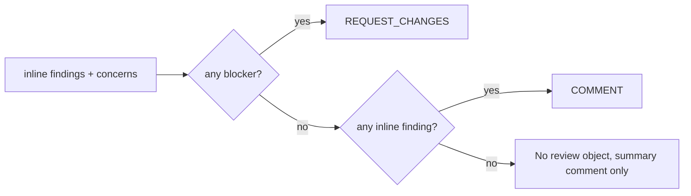

# GitHub objects

Three kinds of object, all owned by loupe's TypeScript, never by the agent.

| Object                         | API                                                                                                                               | Per run                                                | Marker                                                                     |
| ------------------------------ | --------------------------------------------------------------------------------------------------------------------------------- | ------------------------------------------------------ | -------------------------------------------------------------------------- |
| Pull request review            | `pulls.createReview`                                                                                                              | 0 or 1, only if there are inline findings or a blocker | `<!-- loupe:<reviewer> sha=<head> -->` in the body when no inline comments |
| Inline review comment          | created inside the review above; prior ones resolved via GraphQL `resolveReviewThread` (or deleted, or kept, per `priorComments`) | n                                                      | Same marker appended to every comment body                                 |
| Combined summary issue comment | `issues.createComment` first time, `issues.updateComment` after                                                                   | exactly 1, updated after all reviewers finish          | `<!-- loupe:summary:combined -->`, plus each reviewer's SHA marker         |

`<reviewer>` is the reviewer's `name` (or `default` with no config). Inline objects remain reviewer-specific; the single combined summary preserves each reviewer's `<!-- loupe:summary:<reviewer> sha=<head> -->` marker for incremental history.

## The posting sequence

This page expands the **Post review and summary** box in [A review run](./review-run.md#pipeline). Each reviewer snapshots eligible prior threads, posts any required inline review, and then resolves, deletes, or keeps that snapshot according to `priorComments`. After all parallel reviewers finish, the orchestrator creates or updates one combined summary. On migration, old bot-authored per-reviewer summaries are removed after the combined comment exists.

## Review verdict



- **`REQUEST_CHANGES`** counts as a blocking review in the PR UI until dismissed. A later run with no blockers posts a `COMMENT` review, which does not dismiss the earlier request. Dismiss it by hand.
- **Never `APPROVE`.** A bot must not satisfy a required-approver rule.
- **Review body** is empty when there are inline comments. GitHub requires some body when there are none, so a blocker-only review carries just the marker.

## Inline comment body

```
🔴 **blocker** <finding body>

<!-- loupe:<reviewer> sha=<head> -->
```

Severity emoji: 🔴 blocker, 🟡 warning, 🔵 nit.

## Summary comment body

````
### 🔍 loupe · <reviewer>

🔴 1 · 🟡 2 · 4 files · ⚠️ degraded run   (the last part only when something was lost)

<summary from the agent>

#### Concerns

🟡 **title**

<detail>

#### Highlights
- ✅ ...

_3 inline comments on the diff below._

```mermaid   (only if the agent returned a diagram)
...
```

<details><summary>Other notes (n)</summary> off-diff findings, each as its own Markdown block </details>

<details><summary>Run details</summary> mode / verification / scope / dropped counts </details>

Last reviewed commit: `abc1234`

<!-- loupe:summary:<reviewer> sha=<head> -->
````

In ensemble mode, minority findings sit in a second `<details>` block titled "Lower-confidence findings (raised by a minority of models)".

## Author guard

A marker in a comment body is not proof loupe wrote it. A person quoting a loupe comment carries the marker too. Every "is this mine" check pairs the marker with the login from `users.getAuthenticated`, or `github-actions[bot]` when that call fails, which it does for the default Actions token. Only comments under that login are deleted or read for the last-reviewed SHA.

## What happens to prior inline comments

Policy `priorComments`, default `resolve`:

| Policy    | Effect on this reviewer's earlier threads                                                                                                                                        |
| --------- | -------------------------------------------------------------------------------------------------------------------------------------------------------------------------------- |
| `resolve` | Thread is resolved (visible under "Show resolved"). Means "superseded by a newer review", not "bug proven fixed". Threads the token cannot resolve are left open with a warning. |
| `delete`  | Comment is deleted.                                                                                                                                                              |
| `keep`    | Nothing is touched. New comments accumulate.                                                                                                                                     |

Scope, for `resolve` and `delete`:

- **Full run:** every loupe-rooted thread with this reviewer's marker on a currently in-scope file.
- **Incremental run:** only those on the reassessed files. Threads on files unchanged since the last review stay.
- **History lookup failed:** nothing. The review is posted as a full run and the prior threads stay.
- **Never:** the summary comment (updated in place), reviews themselves (GitHub does not allow deleting reviews), human-rooted threads, other reviewers' threads.

Order: snapshot the eligible prior threads, post the new review and summary, then clean up only the snapshot. A failed post leaves the old comments in place. Each resolve or delete fails independently and never falls back to the other action.

Next: [First run vs later runs](./first-vs-incremental.md).
