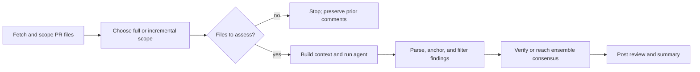

# A review run

`runReviews` fans out one `runReview` per reviewer in `.loupe.json`, in parallel. Everything below happens once per reviewer. Code: `packages/core/src/index.ts`.

## Pipeline

## Step by step

1. **Fetch.** GitHub reads in parallel: `pulls.get`, `pulls.listFiles` (paginated, with patches), and `repos.getContent` for each convention doc at the PR head. Convention paths default to `CLAUDE.md, AGENTS.md, .loupe.md, CONTRIBUTING.md`, prefixed with `dir` when set.
2. **Scope.** Keep files under any listed `dir` that match the reviewer's `include` and miss its `exclude`. Zero files means the reviewer is skipped with no GitHub writes.
3. **Incremental or full.** See [First run vs later runs](./first-vs-incremental.md). Default is incremental. `@loupe review` and the `full` input force full.
4. **Prompts.** Every in-scope PR file's patch is rendered as a `### <path>` section and written to a temp file. loupe greps the checkout for callers of the exports the diff touches, three hops deep within the package. The user prompt carries the file tree, that path, the cwd-to-repo path mapping when `dir` is set, the call-site list, and on an incremental run the list of files to reassess. See [What the agent sees](./context.md).
5. **Run the agent.** For whip: `whip run --format json -quiet -no-session -max-turns <n> -system <prompt> -m <model> -cache-key loupe/<owner>/<repo>/<reviewer>`, prompt on stdin, in a throwaway `WHIP_HOME` built from the config's `whip` block (with `defaultEffort` when `reasoning` is set). `claude` gets `--effort`, `codex` gets `-c model_reasoning_effort`. If the agentic run throws or returns something that is not a review, loupe retries once headless with the reassessed files' diff inlined and marks the run degraded.
6. **Parse.** The last `{...}` in stdout is the review. It must carry a string `summary`, so `{}` or `{"status":"done"}` is a failure, not a clean review; `findings` and `concerns` may be omitted for a clean review but must be arrays when present. Each finding is validated on its own; malformed entries are dropped and counted. Off-scale severities (`critical`, `minor`, ...) map onto blocker, warning, nit.
7. **Scope.** On an incremental run, findings anchored on a file outside the reassessed set are dropped and counted, so they cannot duplicate a prior comment that was deliberately kept.
8. **Anchor.** GitHub only accepts inline comments on lines present in the diff. A finding on an exact diff line stays inline. One within 10 lines snaps to the nearest diff line. Anything else, or on a file not in scope, becomes an off-diff note in the summary.
9. **Profile filter.** `quiet` keeps blockers, `chill` (default) keeps blockers and warnings, `assertive` keeps everything.
10. **Verify.** If any inline findings survived and `verify` is on (default), one more headless call asks the same model to mark each `real: true|false`. It may reject a finding only when the diff itself contradicts it; evidence outside the diff is not grounds for rejection. Findings judged not real are dropped and counted. An error, or a verdict set that is not exactly one verdict per finding, keeps them all and marks verification `failed` or `invalid`. An `ensemble` (≥2 models) replaces this step: every model runs the review, only findings a majority agrees on stay inline, and minority findings are surfaced in a collapsed lower-confidence section.
11. **Post.** See [GitHub objects](./github-objects.md).

## Limits

| Knob | Default | Effect |
| --- | --- | --- |
| `maxTurns` | 10 | Agentic tool-loop cap, per reviewer or top level |
| headless cap | 10, fixed | Safety net for the verify pass and the one-shot retry |
| `reasoning` | harness default | Native effort setting on the harness plus one sentence in the prompt |

Hitting `maxTurns` mid-exploration is an error from the harness, which triggers the headless retry.

The pipeline hands its result to [GitHub objects](./github-objects.md), which defines the review, summary, and cleanup behavior.

Next: [What the agent sees](./context.md).
