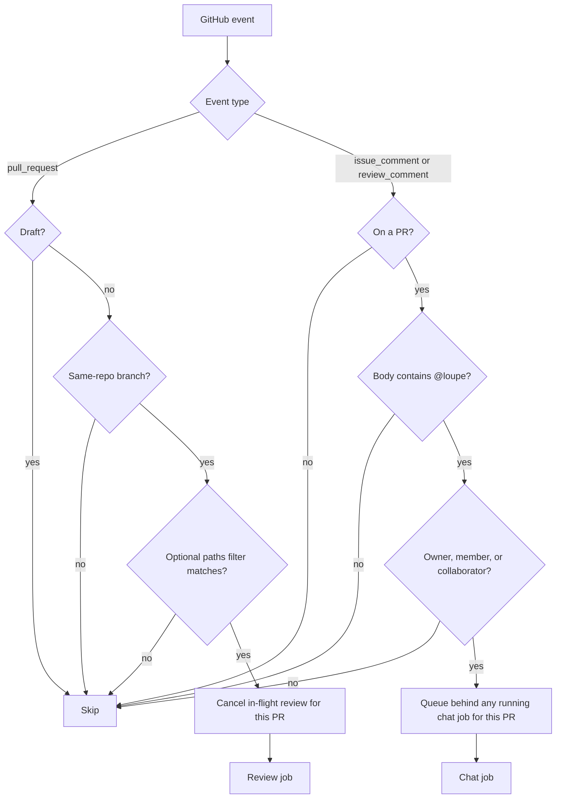

# Triggers

Two workflows, one action. They are separate files so neither shows as a perpetually skipped job on the other's events. loupe ships templates for both in `.github/workflows/`; `examples/` also contains a review workflow template.

| Workflow | Event | Runs when | Permissions |
| --- | --- | --- | --- |
| review | `pull_request`: opened, synchronize, reopened, ready_for_review | PR is not a draft, its branch belongs to this repository, and any optional `paths` filter matches | `id-token: write`, `pull-requests: write`, `contents: read` |
| chat | `issue_comment`, `pull_request_review_comment` (created) | Comment is on a PR, contains `@loupe`, and its author is an owner, member, or collaborator | `id-token: write`, `pull-requests: write`, `contents: write` (for `@loupe fix`) |

## Decision flow

## Concurrency

- **Review:** group `loupe-review-<pr>`, `cancel-in-progress: true`. A push while a review is running kills the old run; the new run reviews the new head.
- **Chat:** group `loupe-chat-<pr>`, `cancel-in-progress: false`. Two mentions in quick succession run one after the other, so a `fix` is never half-pushed.

## Job setup (both workflows)

1. `actions/checkout`. The review workflow lands on the PR merge ref. A comment-triggered chat workflow starts from the default branch; `@loupe fix` fetches and checks out the PR head branch before the agent edits it.
2. Install the harness CLI (`whip`, `claude`, or `codex`).
3. Provide the model provider's API key as an environment variable. Where it comes from (repo secret, Infisical, Vault) is the workflow's business, not loupe's.
4. `uses: context-labs/loupe@main` with `config: <path to .loupe.json>`.

Making every step `continue-on-error: true` keeps a loupe failure from blocking a merge.

## Inside the action

The action reads `GITHUB_EVENT_NAME` and branches once:

- `issue_comment` or `pull_request_review_comment` → [chat handler](./chat.md).
- anything else → [review run](./review-run.md) for every reviewer in the config.

The PR number comes from the event payload (`pull_request.number` or `issue.number`), or from `LOUPE_PR_NUMBER` when run from the CLI.

Next: [A review run](./review-run.md).
